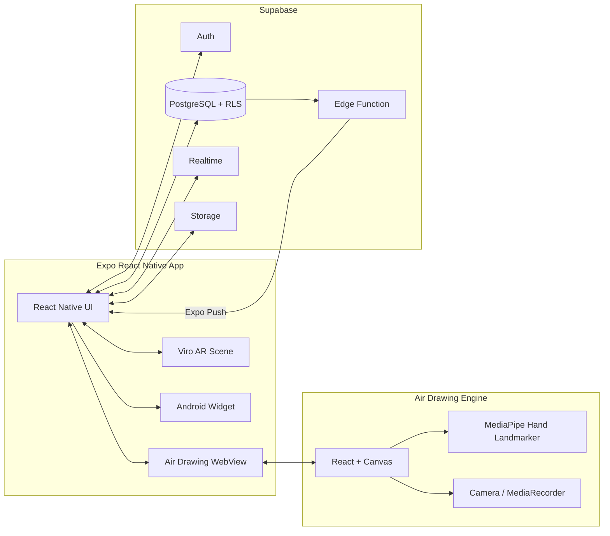

<p align="center">
  
</p>

# 26s-w4-c3-01 · ALine

## 팀원

| 이름 | GitHub | 역할 |
|---|---|---|
| 박지민 | [7immin](https://github.com/7immin) | 소셜 피드·채팅·알림, UI/UX, Supabase 연동 |
| 이지오 | [easy0131](https://github.com/easy0131) | 에어 드로잉 카메라, AR 라운지, Android·Expo 빌드 |

---

## 기획안

- **산출물 주제:** 손끝으로 현실 공간과 소셜 피드를 연결하는 에어 드로잉 SNS **ALine**
- **제작 목적:** 화면을 직접 터치하지 않고 카메라 앞 손동작으로 콘텐츠를 만들고, 게시물·채팅·AR 공간에 공유하는 새로운 소셜 인터랙션을 제공한다.
- **선택 옵션:** 실시간 인터랙션
- **핵심 구현 요소:**
  - MediaPipe Hand Landmarker 기반 손 추적과 핀치 제스처 드로잉
  - 사진·영상 촬영, 색상·굵기·지우개를 지원하는 에어 드로잉 카메라
  - Supabase Auth·Postgres·Storage·Realtime 기반 소셜 데이터
  - QR로 원점을 맞추고 같은 낙서를 공유하는 Viro AR 라운지
  - 맞팔 사용자 간 1:1 실시간 채팅과 에어라이팅·게시물 공유
  - 좋아요·팔로우 알림과 Expo Push Notification
  - 최신 게시물을 보여주는 Android 홈 화면 위젯
- **사용 / 시연 시나리오:**
  1. 이메일 또는 Google 계정으로 로그인하고 프로필과 나만의 하트를 설정한다.
  2. 카메라 앞에서 엄지와 검지를 모아 허공에 그림을 그린다.
  3. 낙서가 포함된 사진 또는 영상을 촬영해 게시물로 공유한다.
  4. 다른 사용자의 게시물에 나만의 하트로 좋아요를 표시하고 댓글을 남긴다.
  5. 맞팔 사용자와 텍스트·에어라이팅·게시물을 실시간 채팅으로 주고받는다.
  6. 같은 QR을 스캔해 AR 라운지에 입장하고 현실 공간에 낙서를 배치한다.

### 개발 일정

| 날짜 | 목표 |
|---|---|
| Day 1 | 서비스 기획, 사용자 흐름, UI 콘셉트와 데이터 구조 설계 |
| Day 2 | React·Expo 프로젝트 구성, 인증과 프로필 온보딩 |
| Day 3 | MediaPipe 손 추적, 핀치 드로잉과 카메라 촬영 구현 |
| Day 4 | 게시물 피드, 좋아요·댓글·팔로우와 사용자 검색 구현 |
| Day 5 | 1:1 실시간 채팅, 게시물 공유와 푸시 알림 구현 |
| Day 6 | QR 기반 Viro AR 라운지와 공간 낙서 동기화 구현 |
| Day 7 | Android 위젯, 실제 기기 테스트, 카메라 안정화와 문서화 |

---

## 구현 명세서

| 구현 요소 | 설명 | 우선순위 |
|---|---|---|
| 인증·온보딩 | 이메일/Google 로그인, 아이디 중복 확인, 프로필·하트 설정 | 필수 |
| 손 추적·에어 드로잉 | MediaPipe로 손 관절을 추적하고 핀치 상태에서 선을 그림 | 필수 |
| 사진·영상 촬영 | 낙서 유무와 관계없이 촬영하고 미리보기에서 게시물 작성 | 필수 |
| 피드·게시물 | 팔로우 기반 피드, 상세 보기, 수정·삭제, 재생 | 필수 |
| 좋아요·댓글 | 사용자별 하트 이미지, 댓글 작성·삭제, 실시간 알림 | 필수 |
| 팔로우·프로필 | 사용자 검색, 팔로워·팔로잉 목록, 프로필 게시물 그리드 | 필수 |
| 맞팔 1:1 채팅 | 텍스트·에어라이팅·게시물 공유, 읽음 상태 | 필수 |
| QR AR 라운지 | QR 인식, 공간 원점 정렬, AR 낙서와 접속자 동기화 | 필수 |
| 푸시 알림 | 좋아요·팔로우 이벤트를 Expo Push로 전달 | 선택 |
| Android 위젯 | 최신 게시물 표시와 앱 카메라·라운지 진입 | 선택 |

---

## 아키텍처



- React Native가 인증, 피드, 프로필, 채팅과 전체 내비게이션을 담당한다.
- 카메라 기반 에어 드로잉은 React·MediaPipe 번들을 로컬 WebView에서 실행한다.
- AR 라운지는 Viro ARScene에서 카메라 좌표계를 기준으로 3D 선을 렌더링한다.
- Supabase RLS가 사용자별 데이터 접근을 제한하고, Realtime이 채팅·알림·라운지 변경을 전달한다.
- 촬영 이미지·영상·아바타·에어라이팅 결과는 Supabase Storage에 저장한다.

---

## 설계 문서

### 주요 화면 / 인터페이스

#### 1. 로그인·프로필 온보딩

- 이메일 및 Google 로그인
- 사용자 아이디·닉네임·프로필 이미지 설정
- 직접 그린 하트 또는 기본 하트 선택

#### 2. 에어 드로잉 카메라

- 엄지와 검지 핀치로 허공에 선 그리기
- 색상, 펜 굵기, 지우개, 실행 취소, 줌
- 낙서 없이 사진·영상 촬영 가능

#### 3. 소셜 피드

- 팔로우한 사용자와 내 게시물 표시
- 스와이프 탐색, 영상 재생, 좋아요·댓글
- 게시물 상세 보기, 수정·삭제, 채팅 공유

#### 4. 맞팔 채팅

- 맞팔 관계에서만 대화 생성과 메시지 전송 허용
- 텍스트, 에어라이팅 이미지, 게시물 메시지
- 실시간 수신, 안 읽음 표시와 읽음 상태

#### 5. QR AR 라운지

- `ALine-숫자` 또는 등록된 `qrly.org` QR 인식
- 인식한 화면에서 바로 공간 정렬
- 같은 QR 사용자 간 3D 낙서와 접속 상태 공유

샘플 라운지 QR:

<p align="center">
  
</p>

### 데이터 구조

| 영역 | 주요 데이터 | 역할 |
|---|---|---|
| 인증·프로필 | `auth.users`, `profiles` | 계정, 아이디, 닉네임, 아바타, 사용자 하트 |
| 게시물 | `posts`, `post_likes`, `post_comments` | 이미지·영상·드로잉 문서, 좋아요와 댓글 |
| 소셜 | `follows`, `notifications`, `push_tokens` | 팔로우 관계, 앱 내 알림, 기기 푸시 토큰 |
| 채팅 | `conversations`, `messages`, `conversation_reads` | 맞팔 1:1 대화, 메시지와 읽음 시각 |
| AR 라운지 | `lounges`, `lounge_contents` | QR 공간과 사용자별 3D 낙서 데이터 |
| Storage | posts, chat-images, avatars, air-drawing assets | 이미지·영상·WebView 번들 저장 |

### API / 외부 서비스 연동

| 방식 | 서비스 / 자원 | 설명 | 비고 |
|---|---|---|---|
| Auth | Supabase Auth | 이메일·Google 로그인과 세션 관리 | 모바일 딥링크 사용 |
| REST | Supabase Data API | 프로필·게시물·팔로우·채팅 데이터 CRUD | RLS 적용 |
| Realtime | Supabase Postgres Changes | 채팅, 알림, 라운지 콘텐츠 갱신 | 채널 구독 |
| Realtime | Supabase Presence | 라운지 온라인 사용자 상태 | 사용자별 presence |
| Storage | Supabase Storage | 게시물·채팅·아바타·번들 업로드 | 버킷별 정책 |
| Vision | MediaPipe Tasks Vision | 손 관절과 핀치 제스처 추론 | 기기 내 실행 |
| AR | ARCore + React Viro | 카메라 좌표와 3D 폴리라인 렌더링 | Android 실제 기기 |
| Push | Expo Push API | 좋아요·팔로우 알림 전달 | Edge Function 연동 |

---

## 산출물 및 실행 방법

- **산출물 설명:** 에어 드로잉 게시물, 맞팔 채팅, QR 기반 AR 라운지를 제공하는 Android 중심 소셜 앱
- **실행 환경:** Node.js 20+, Android Studio, JDK 17+, Android ARCore 지원 기기
- **백엔드:** Supabase Auth, PostgreSQL, Realtime, Storage, Edge Functions
- **패키지 구조:**
  - `mobile/` — Expo React Native 앱과 Android 네이티브 위젯
  - `frontend/` — React 웹 앱과 에어 드로잉 WebView 번들
  - `supabase/` — 데이터베이스 마이그레이션과 Edge Functions

### 모바일 실행 방법

```bash
cd mobile
npm ci
```

`mobile/.env.example`을 복사해 `mobile/.env.local`을 만들고 값을 설정한다.

```dotenv
EXPO_PUBLIC_SUPABASE_URL=https://your-project.supabase.co
EXPO_PUBLIC_SUPABASE_PUBLISHABLE_KEY=your-publishable-key
GOOGLE_CLOUD_API_KEY=your-arcore-api-key
```

네이티브 모듈과 AR 기능을 사용하므로 Expo Go가 아닌 개발 빌드가 필요하다.

```bash
npx expo run:android
npm start
```

이미 개발 앱이 설치되어 있다면 Metro만 실행한 뒤 앱에서 개발 서버에 연결한다.

### Android APK 빌드

```bash
cd mobile
npx eas build --platform android --profile preview
```

`preview` 프로필은 현재 사용하는 Android 기기에 맞춰 `arm64-v8a` APK를 생성한다.

### 웹 / 에어 드로잉 번들

```bash
cd frontend
npm ci
npm run build
npm run build:airview
```

### 데이터베이스

새 Supabase 프로젝트에서는 `frontend/supabase/schema.sql`을 기준으로 스키마를 구성한다. 이후 변경 사항은 `supabase/migrations/`의 마이그레이션을 순서대로 적용한다.

### 검증

```bash
# 모바일 TypeScript
cd mobile
npm run typecheck

# 웹 빌드와 린트
cd ../frontend
npm run build
npm run lint
```

### 기술 구성

| 분류 | 사용 기술 |
|---|---|
| Mobile | Expo SDK 57, React Native 0.86, TypeScript |
| Navigation / UI | React Navigation, Reanimated, Gesture Handler, React Native SVG |
| Air Drawing | React, Canvas, MediaPipe Tasks Vision, WebView |
| AR | React Viro, ARCore, Expo Camera |
| Backend | Supabase Auth, PostgreSQL, RLS, Realtime, Storage |
| Notification | Expo Notifications, Supabase Edge Functions |
| Android Native | Kotlin, AppWidgetProvider |
| Web | React 18, Vite, Three.js |
| Build | EAS Build, Gradle |

---

## 회고 문서

### Keep — 잘 된 점, 다음에도 유지할 것

- 손 추적 엔진을 별도 React 번들로 분리해 웹과 모바일 WebView에서 같은 드로잉 로직을 활용한 점
- 게시물·채팅·AR 라운지를 “손으로 만든 콘텐츠 공유”라는 하나의 사용자 경험으로 연결한 점
- Supabase RLS와 앱 검사를 함께 적용해 맞팔 채팅 등 권한 규칙을 이중으로 보호한 점
- 실제 Android 기기에서 카메라 생명주기와 AR 전환 문제를 반복 검증한 점

### Problem — 아쉬웠던 점, 개선이 필요한 것

- WebView 카메라와 Viro AR 카메라가 전환될 때 제조사별 해제 시점 차이가 컸음
- ARCore와 네이티브 위젯 때문에 Expo Go만으로 전체 기능을 검증할 수 없었음
- 손 인식 정확도와 프레임 성능이 조명, 배경, 기기 성능에 영향을 받았음
- 모바일과 웹에 유사한 화면이 있어 기능 변경 시 동기화 비용이 발생했음

### Try — 다음번에 시도해볼 것

- 다양한 Android 제조사에서 카메라·AR 전환을 자동 검증하는 실제 기기 테스트 확대
- 손 추적 품질과 배터리 사용량을 함께 측정하는 성능 프로파일링
- AR 라운지 콘텐츠의 편집·신고·보관 정책과 오프라인 복구 로직 보강
- 모바일과 WebView 사이의 공통 타입·이벤트 계약을 별도 패키지로 분리

---

## 참고 자료

- [프로젝트 저장소](https://github.com/madcamp-official/w4-c3-01)
- [Expo Documentation](https://docs.expo.dev/)
- [MediaPipe Hand Landmarker](https://ai.google.dev/edge/mediapipe/solutions/vision/hand_landmarker)
- [Supabase Documentation](https://supabase.com/docs)
- [React Viro Documentation](https://viro-community.readme.io/)
- [ARCore Documentation](https://developers.google.com/ar)
